<!-- Generated by GitHub Profile Agent Console. Edit profile.config.json, then run npm run generate. -->

  <picture>
    <source media="(max-width: 760px) and (prefers-color-scheme: dark)" srcset="./assets/hero/agent-console-96b918eb-mobile-dark.svg">
    <source media="(max-width: 760px)" srcset="./assets/hero/agent-console-96b918eb-mobile-light.svg">
    <source media="(prefers-color-scheme: dark)" srcset="./assets/hero/agent-console-96b918eb-dark.svg">
    <source media="(prefers-color-scheme: light)" srcset="./assets/hero/agent-console-96b918eb-light.svg">
    
  </picture>

  
  
  

## About Me

Computer Science Engineering student at PPG Institute of Technology, building full-stack web applications with the MERN stack.

Focused on problem-solving, responsive UX design, and building real-world solutions in web development and healthcare tech.

## Current Focus

| Area | What I am exploring |
| --- | --- |
| **Full-Stack Web Dev** | Building complete web applications using the MERN stack and modern web tools. |
| **Problem Solving** | Converting requirements into functional code through structured learning and practice. |
| **Healthcare Tech** | Interested in building impactful software solutions for real-world healthcare challenges. |

## Featured Work

| Project | Focus | Why it matters |
| --- | --- | --- |
| [**Paalam System**](https://github.com/Build-with-AI-Code-for-Communities/health-team-284-the-conquerors) | Healthcare Tech | Offline-first stock coordination system connecting rural PHC clusters and bridging medicine inventory gaps. |
| [**Portfolio Site**](https://github.com/crazypravee124567-source/praveen-portfolio2) | Personal Portfolio | Interactive portfolio showcasing full-stack web development projects, freelance work, and coding journey. [Live](https://praveen-portfolio2-o75d.vercel.app/) |
| [**Food Delivery App**](https://github.com/crazypravee124567-source) | Food Delivery Platform | Full-stack food delivery platform built with MERN stack featuring user authentication and restaurant browsing. |

## Research Direction

I focus on converting concepts into functional, user-friendly applications while continuously improving problem-solving skills through practice, freelancing, and impactful project builds.

## Tech Stack

`JavaScript` · `React` · `Node.js` · `Express` · `MongoDB` · `Vite` · `Python` · `HTML5` · `CSS3` · `Git` · `Vercel`

## Recent Activity

<!-- AUTO:ACTIVITY:START -->
_Recent public activity will appear here after the workflow runs._
<!-- AUTO:ACTIVITY:END -->

---

  Building clean, thoughtful web applications and learning by shipping real projects.

